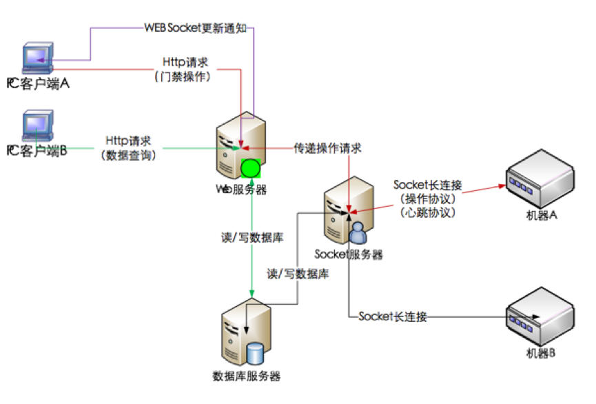
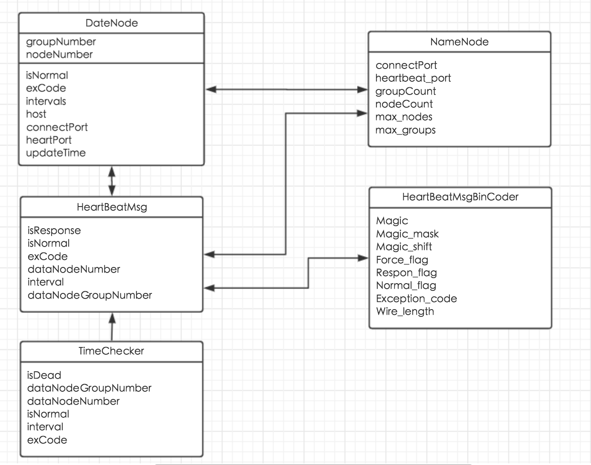
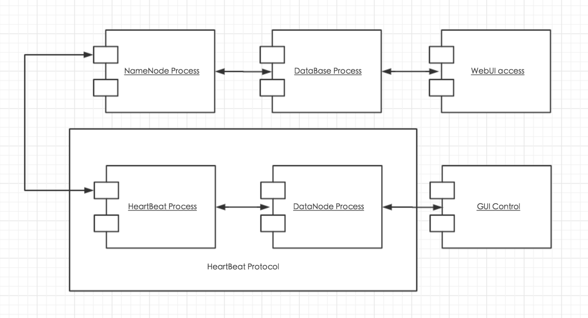
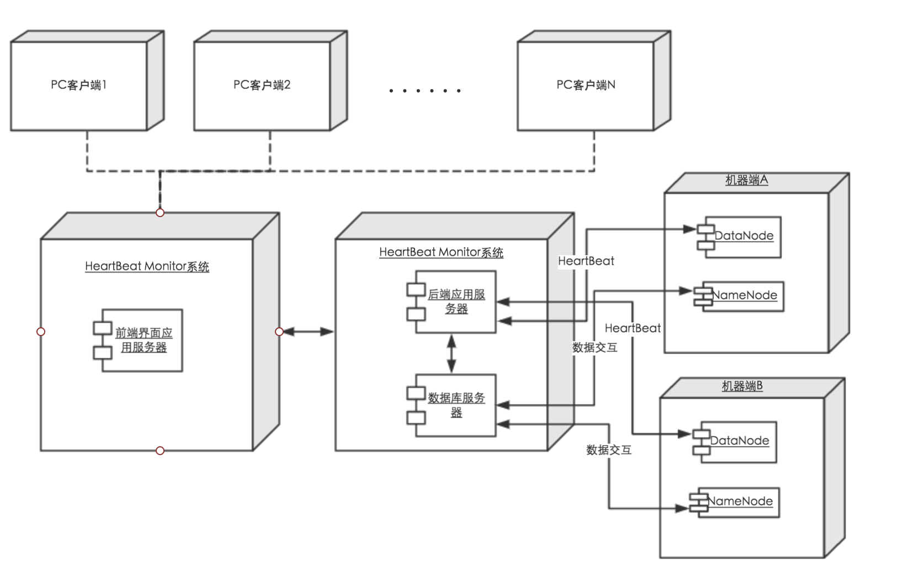
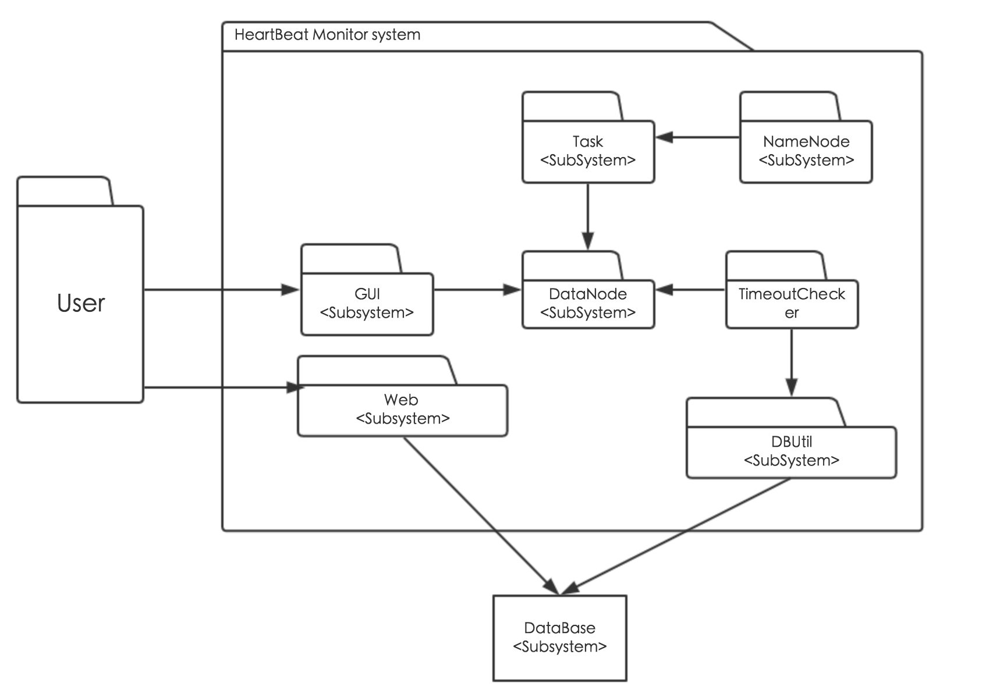
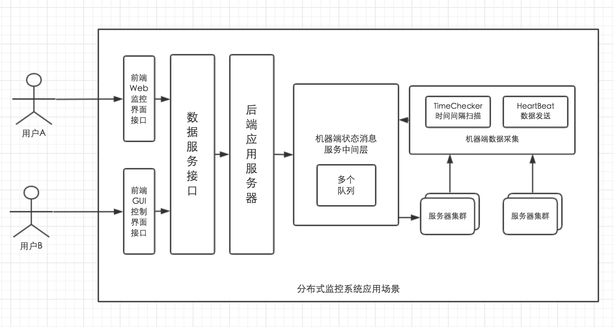
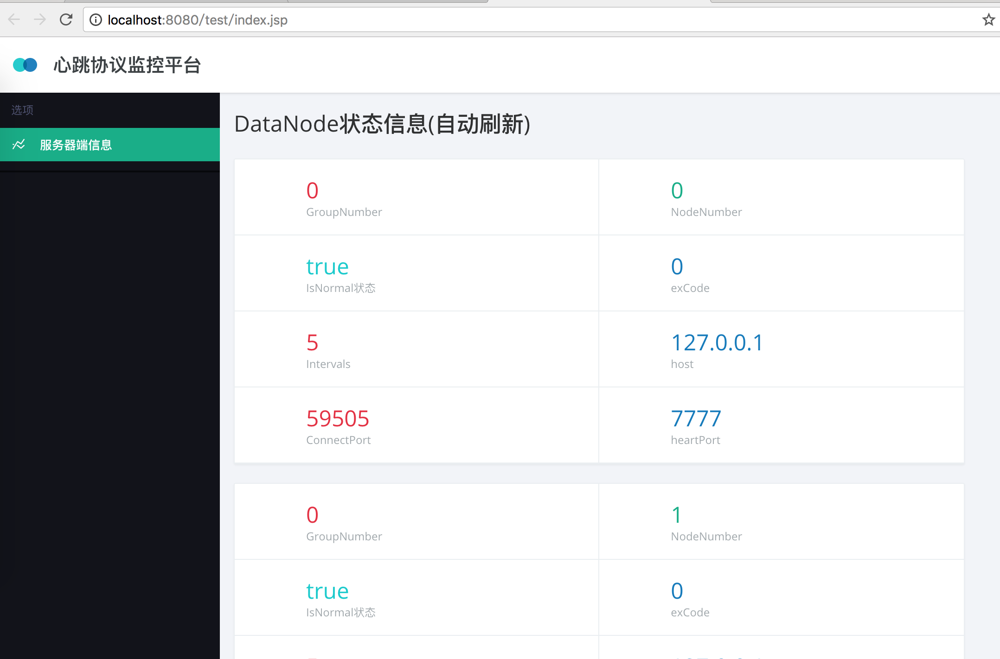

# 项目概述

分布式监控管理系统，方便用户随时了解分布式集群的情况（机器的状态）以及及时进行各种机器的操作。




# HeartBeat心跳协议数据包规格
```
 0  1  2  3  4  5  6  7  0  1  2  3  4  5  6  7
+--+--+--+--+--+--+--+--+--+--+--+--+--+--+--+--+
|    Magic        |Flags|S |    Exception Code  |
+--+--+--+--+--+--+--+--+--+--+--+--+--+--+--+--+
|                                               |
|              DataNode Number                  |
+--+--+--+--+--+--+--+--+--+--+--+--+--+--+--+--+
|              Group Number                     |
+--+--+--+--+--+--+--+--+--+--+--+--+--+--+--+--+
|                 Interval                      |
+--+--+--+--+--+--+--+--+--+--+--+--+--+--+--+--+

Magic: 6 bits，魔术数，用来表明这是什么协议，这里取101001
Flags: 2 bits, 1 bit 表示查询位，如果是1，表明NameNode强制查询当前DataNode的状态，是DataNode发送的；
               0 表示是DataNode主动发来的HeartBeat，正常情况是0;
               1 bit 表示响应还是请求，0表示请求request，1表示响应response
S    : 1 bit,  表示DataNode状态， 0表示异常，1表示正常
EC   : 7 bits, 表示异常码，如果S=1， 则需要对应的EC查看是什么异常
DN   : 32bits, 表示DataNode的ID标识，是一个int类型
GN   : 16bits, 表示DataNode所属的组号，是一个short int类型
I    : 16bits, 表示HeartBeat的时间间隔，是一个short int类型， 单位是秒，因此最大间隔是32768s，大概9个小时
```


# 架构设计

#### 系统架构

* 分布式监控系统分为DataNode和NameNode两个线程，DataNode作为服务器端维护一个HeartBeatUDP线程通过UDP端口定时发送HeartBeatMsg心跳包（心跳协议）。

* NameNode主线程通过TCP与DataNode线程连接。NameNode线程维护DataNode线程的集合，汇报DataNode的状态信息。

* NameNode包含HeartBeatUDP线程和TimeoutChecker线程，其中HeartBeatUDP线程负责收发所有DataNode的心跳包，TimeoutChecker线程定时扫描DataNode集合，查看DataNode是否是dead状态。

* GUI模式下传送DataNode指令，分为开机，关机，宕机以及死机，控制DataNode状态，返回服务器端和客户端的状态信息。Web端通过http请求读取数据库服务器信息。

#### 通信架构

NameNode启动	: TCP连接端口启动，UDP监听端口启动		
DataNode启动: 与NameNode建立连接		
DataNode : 分配groupNumber，nodeNumber	
DataNode : 发送HeartBeatMsg心跳包	
NameNode : intervals间隔时间汇报DataNode状态信息
DataNode : 接收killed指令
NameNode : 汇报DataNode的Dead状态信息。


# View设计
#### LogicView


系统逻辑视图，该视图以图形方式说明关键的用例实现、子系统、包和类,包含了DateNode，NameNode，HeartBeatMsg，HeartBeatMsgBinCoder和Client的主属性，提供的交互方式。



#### ProcessView


分布式监控系统通过GUI模式的命令控制DataNodeProcess进程，DataNodeProcess维护HeartBeatProcess发送心跳报文，NameNodeProcess接受并监控DataNodeProcess集合，数据库DataBaseProcess记录并由Web监控平台访问。




#### DevelopmentView
开发视图描述了分布式监控系统的静态组织结构，如下的分层架构，每一层为上一层提供良好定义的接口。




#### DeploymentView
部署视图描述了系统软件映射到硬件上，考虑的分布式监控的系统性能、规模、可靠性等。
物理架构主要关注系统非功能性的需求，如可用性、可靠性（容错性），性能（吞吐量）和可伸缩性。





#### Scenarios

场景描述将上述4个视图结合，构件了系统各部分的相互关系，如下列举了典型的由用户驱动的分布式监控系统应用场景。

关键的功能点在于如何对分布式服务器的集群进行监控：由前端接口，到数据服务接口，到后端应用服务器获取机器短的状态消息，这些过程由系统消息服务中间层完成。服务器集群定期发送心跳包收集状态信息，向系统消息服务中间层汇报采集，完成场景循环。




# 监控界面
收集监控DataNode的状态，自动轮询数据库字段并显示在前端平台













